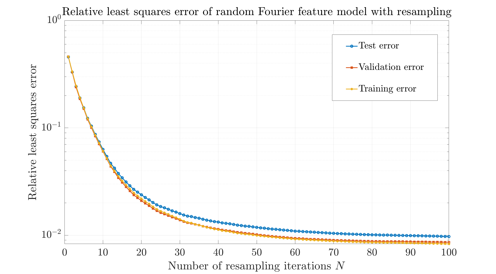
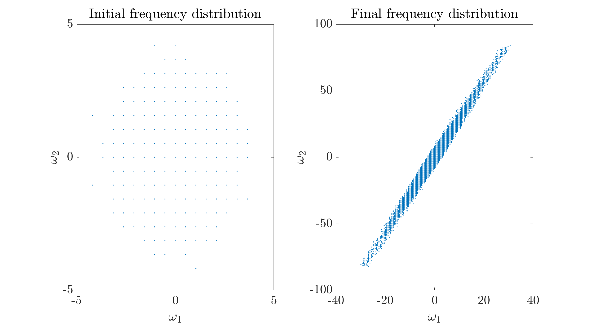
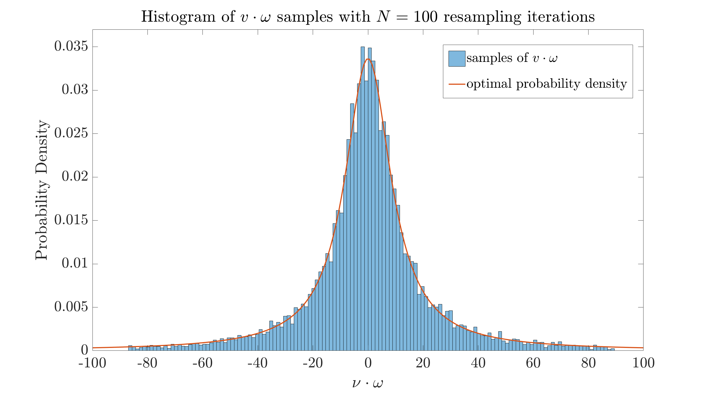
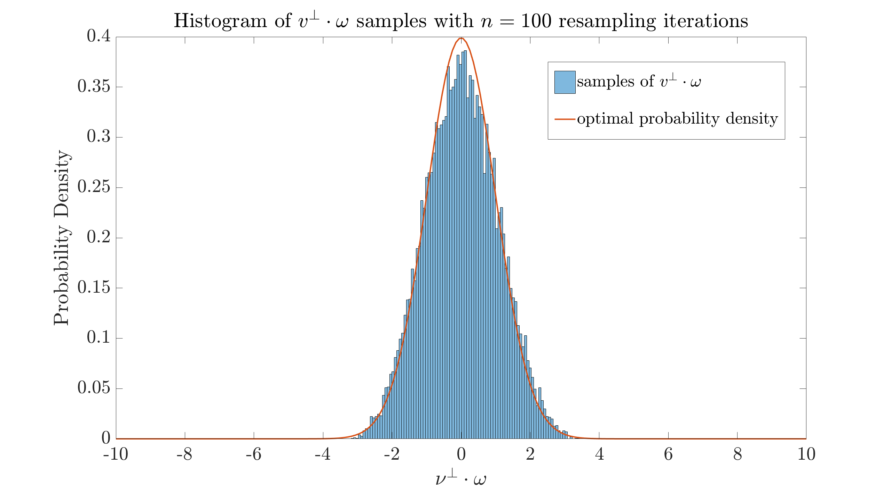

#  Implementation of Adaptive Resampling for Random Fourier Features
This repository provides the implementation of the *adaptive resampling algorithms* proposed in the manuscript [1], based on the *random Fourier feature* (RFF) framework. The method incorporates a Newton–Raphson optimization scheme to efficiently solve the regularized least squares problem for regression tasks.


## 1. Overview
This project focuses on approximating a target function using a kernel-inspired random Fourier feature model. The key contributions include:
- Improved resampling algothms for adaptive selection of Fourier frequencies.
- A regularized loss function for stable regression performance under over-parametrization.
- A Newton-Raphson method to handle penalization efficiently.
- Numerical experiments validating generalization ability of the trained RFF model.
  
## 2. Basic setup and objective function
We consider a regression problem with given data $\{(x_j,y_j)\in\mathbb{R}^d\times\mathbb{R}:j=1,\dots,J\}$, with the *response variable*
$$
y_j=f(x_j)+\xi_j
$$ 
where $f(x)$ is the *target function* and $\xi_j$ satisfying $\mathbb{E}[\xi_j]=0$, $\mathbb{E}[\xi_j^2]=s^2$ is a random *noise variable*.
We consider specifically training the *random Fourier feature network model*
$$
\beta(x;\hat{\beta},\omega)=\sum_{k=1}^K \hat{\beta}_k\, \mathrm{e}^{\mathrm{i}\omega_k\cdot x}
$$
to approximate the target function $f(x)$ with i.i.d. samples of *frequency parameters* $\{\omega_k\}_{k=1}^K$ under a probability density $p(\cdot)$, through the minimization formulation over the *amplitude coefficients* $\hat{\beta}\in\mathbb{C}^K$ as:
$$
\min_{\hat{\beta}\in\mathbb{C}^K}\big( \underbrace{\frac{1}{J}\sum_{j=1}^J|\beta(x_j)-y_j|^2}_{=:L_1(\hat{\beta})}+\underbrace{\lambda_1\sum_{k=1}^K |\hat{\beta}_k|^2}_{=:L_2(\hat{\beta})}+\underbrace{\lambda_2(\sum_{k=1}^K |\hat{\beta}_k|^2)^2}_{=:L_3(\hat{\beta})}\big)\,.\tag{1}
$$
The minimization of the loss function $L_1(\hat{\beta})+L_2(\hat{\beta})$ involves the least squares loss and *Tikhonov regularization*, which yields the *normal equation*:
$$(S^\dagger S+(J\lambda_1)I)\hat{\beta}=S^\dagger y\,,$$
where $S\in\mathbb{C}^{J\times K}$ is the *design matrix* of the random Fourier feature model with elements 
$$
S_{jk}=\mathrm{e}^{\mathrm{i}\omega_k\cdot x_j}\,.
$$
The third penalization term $L_3(\hat{\beta})$ is introduced to further control the *generalization error* of the trained model $\beta(x)$ over unseen test data. The overall loss function, defined as: 
$$L(\hat{\beta})=L_1(\hat{\beta})+L_2(\hat{\beta})+L_3(\hat{\beta})\tag{2}$$
 is minimized using an efficient Newton–Raphson iterative scheme. Further algorithmic details are provided in **Section 5**. 


## 3. Resampling of frequency parameters
In manuscript [1], the optimal density $p_\ast(\cdot)$ for the sampling of frequency parameters: 
$$ p_\ast(\omega_n)=\frac{|\hat{f}(\omega_n)|}{\sum_{n\in\mathbb{Z}^d}|\hat{f}(\omega_n)|}\tag{3}$$
is derived. Motivated by this result, we implement a resampling strategy that draws independent frequency samples **with replacement** from the distribution
$$\bar{p}(\omega_n,\bar{\beta})=\frac{|\bar{\beta}_n|}{\sum_{\{n:|\bar{\beta}_n|\geq \epsilon\}}|\bar{\beta}_n|}\,,\tag{4}$$
where 
$$
\bar{\beta}_n:=\sum_{\{k:\nu_k=\omega_n\}}\hat{\beta}_k
$$
is the sum of the neural network amplitudes corresponding to the same basis function $\mathrm{e}^{\mathrm{i}\omega_n\cdot x}$, and $\epsilon>0$ is a cutoff parameter excluding the amplitudes below this threshold. In particular, we proposed and tested the following adaptive algorithm which updates the frequency parameters iteratively with random walk and resampling steps:
#### Algorithm: Adaptive resampling with random walk on lattice
**Input:** training data $\{(x_j, y_j)\}_{j=1}^J$
**Output:** random Fourier feature model $x\mapsto\sum_{k=1}^K\hat\beta_k\, \mathrm{e}^{{\rm i}\omega_k\cdot x}$
Choose a number of resampling iterations $N$, random walk step size $\delta$,  cutoff $\epsilon$,  and Tikhonov parameters $\lambda_1,\lambda_2$
Set $(\omega_1,\ldots,\omega_K) = 0$   $\quad$// *Initialization of frequencies*
**for** $n = 1$ **to** $N$ **do**:
$\quad\;$ $\zeta_k \gets$ sample standard normal  in $\mathbb{R}^{d}$ for $k=1,\ldots,K$
$\quad\;$ // *random warlk step*:
$\quad\;$ $\omega_k \gets$ project $\omega_k + \delta \zeta_k$ to the periodic lattice $\pi L^{-1}\mathbb Z^d$ for $k=1,\ldots,K$ 
$\quad\;$ // *least squares step*:
$\quad\;$ $\hat{\beta} \gets$ approximate solution to optimization problem (1) given $\omega$ and the data
$\quad\;$ // *resampling step with cutoff $\epsilon$*:
$\quad\;$ $\omega \gets$ sample from $\{\omega_1,\ldots, \omega_K\}$  with replacement $K$ independent frequencies 
$\quad\;$ using multinomial resampling based on probability density (4)
**end for**
$\hat{\beta} \gets$ approximate solution to optimization problem (1) given $\omega$ and the data
$x\mapsto\sum_{k=1}^K\hat\beta_k \,\mathrm{e}^{{\rm i}\omega_k\cdot x}$

## 4. An illustration of the convergence of the resampling algorithm
As an illustrative numerical example, we apply the proposed RFF resampling algorithm to approximate the target function
$$
f(x)=\mathrm{e}^{-|v\cdot x|/a}\,\mathrm{e}^{-|x|^2/2}\,,
$$
whose Fourier transform $\hat{f}(\omega)$ yields a fat-talied Cauchy distribution of frequency parameters in one direction. We specifically choose $x\in\mathbb{R}^2$, $a=0.1$, and a random normalized direction vector $v=(0.3308, 0.9437)$. The random Fourier feature model $\beta(x;\hat{\beta},\omega)$ is trained based on a given training data set $\{(x_j,f(x_j))\}_{j=1}^J$  with $J=15000$ data points, using a Fourier feature neural network having $K=1.5J$ nodes. Other hyperparameter of the model are $\delta=0.5$, $\lambda_1=KJ^{-1/2}/100$, $\lambda_2=0$, $\epsilon=K^{-1/2}/200$, and $s=0$.
The relative least squares error 
$$
\frac{\sum_{j=1}^J|f(x_j)-\beta(x_j)|^2}{\sum_{j=1}^J|f(x_j)|^2}
$$
of the trained RFF model $\beta(x)$ alongside the increased number of resampling iterations is given in **Figure 1**.

**Figure 1.** Relative least squares error of the random Fourier feature model $\beta(x)$ trained with resampling algorithm.

The initial frequency parameters are generated from a simple standard normal distribution on the lattice points, while after $N=100$ resampling iterations, the final frequecy parameter distribution is rotated due to the random vector $v$, showing good agreement with the optimal probability density function given by Equation (3) based on $\hat{f}$.

**Figure 2.** The initial and final distribution of frequency parameter samples.


**Figure 3.** The histogram of rotated frequency samples $v\cdot\omega$ after $N=100$ resampling iteration steps.


**Figure 4.** The histogram of rotated frequency samples $v^\perp\cdot\omega$ after $N=100$ resampling iteration steps.

In manuscript [1] we also proposed and tested a variant of the lattice random walk-based reampling algorithm, which utilizes the empirical covariance matrix of the frequencies. More numerical results are summarized in the Section 7 of manuscript [1].

## 5. Newton-Raphson optimization of the regularized loss function
Due to the convexity of the total loss function $L$ as defined in Equation (2), the minimizer $\hat{\beta}$ is obtained by the solution of the first-order optimality condition:
$$
\nabla L(\hat{\beta})=0
$$
Since the parameter vector $\hat{\beta}\in\mathbb{C}^K$ is complex-valued, we decompose it into its real and imaginary components:
$$
\hat{\beta}=a+ib,\;\;\textup{where}\;\,a, b\in\mathbb{R}^K\,.
$$
We compute the gradient and Hessian with respect to $a$ and $b$ seperately, leading to a real-valued system of size $2K\times 2K$. The corresponding Hessian matrix takes the block form:
$$
H=\begin{bmatrix}
H_{aa} & H_{ab} \\
H_{ba} & H_{bb}
\end{bmatrix}\,,
$$
where each block is a $K\times K$ matrix obtained by differentiating the real-valued objective function with respect to $a$ and $b$.
#### Newton–Raphson Iteration
At each iteration, the update step is computed as:
$$
\begin{bmatrix}
a^{(t+1)}\\
b^{(t+1)}
\end{bmatrix}=
\begin{bmatrix}
a^{(t)}\\
b^{(t)}
\end{bmatrix}-H^{-1}\nabla L\,,
$$
where $\nabla L$ is the concatenated gradient with respect to $a$ and $b$, and $H$ is the full block Hessian matrix. This formulation enables second-order convergence behavior.


##  References

[1] *Convergence for Adaptive Resampling of Random Fourier Features*, arXiv preprint   
<!--Available at: [https://arxiv.org/abs/2406.01234](https://arxiv.org/abs/2406.01234)-->


<!--**Bold**, *Italic*, `Code`

- Bullet point
1. Numbered list

[Link](https://example.com)


You can include LaTeX-style math expressions if you're using **Markdown Preview Enhanced**:

markdown
Inline math: $y = x^2$

Block math:
$$
\int_0^1 x^2 dx = \frac{1}{3}
$$


``` 
Code snippet
```
-->